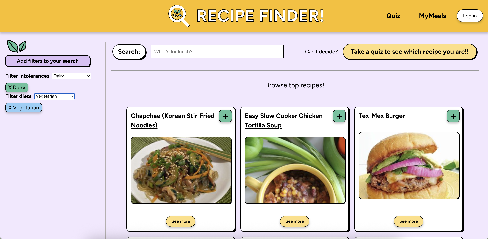

# 🍽️ Recipe Finder (Vite + React + TS)

A web app that lets users search, filter, and save recipes to a personal meal list. Can't decide? take a fun quiz to see "Which recipe you are?" that matches personality to recipe.

Live Application: https://recipe-finder-ashen-eta.vercel.app/



## Tech Stack

- **Frontend:** React, TypeScript, CSS
- **Database & Auth:** Firebase Firestore, Google OAuth
- **DevOps & Cloud:** Docker, Google Cloud Platform (GCP)
- **Deployment:** Vercel

## Key Features

- **Smart Search:** Filter recipes from Spoonacular API by diets and intolerances
- **Personality Quiz:** A fun "Which Recipe Are You?" quiz that gives you a recipe based on chosen answers
- **Saved Meals:** Save and remove recipes to a custom "MyMeals" list
- **User Profiles:** Secure Google login to save preferences across sessions

## Set up instructions

(Requires Node.js, pnpm, Spoonaculary API key, Firebase project with Firestore and Authentication enabled, and Firebase service account key)

Environment variables needed:
- SPOONACULAR_API_KEY=your_spoonacular_api_key
- VITE_API_URL=server_url

1. Clone the repository
2. Set up the server (see below)
3. Set up the client (see below)

## How to run the client and server

### Server
(Express + Typescript)

```bash
    cd server
    pnpm install
```

### Client
(React + TypeScript)

```bash
    cd client
    pnpm install
    pnpm run dev
```

(Final Project for INFO 1998: Trends in Modern Web Development)
By Mylan Pham
Date: 3/27/2026-5/5/2026